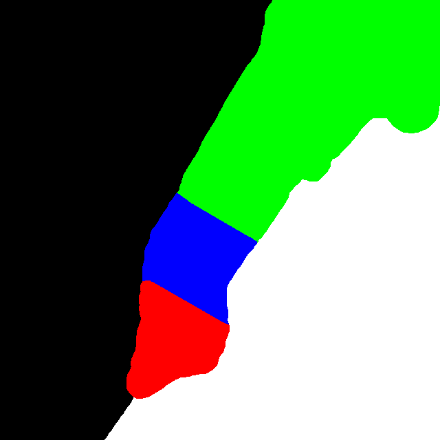

Taxi GPS Data as Pervasive City-Scale Resilience Sensors
=============

##1)Overview

The code in this repository can be used to reproduce the results of paper "Using coarse GPS data to quantify city-scale transportation system resilience to extreme events" by Brian Donovan and Dan Work.  The purpose of this analysis is to extract meaningful information from large-scale taxi data, which can be downloaded [here](https://uofi.box.com/s/zmggziub40wx1bq2h9bq).

##2)License

This software is licensed under the *University of Illinois/NCSA Open Source License*:

**Copyright (c) 2013 The Board of Trustees of the University of Illinois. All rights reserved**

**Developed by: Department of Civil and Environmental Engineering University of Illinois at Urbana-Champaign**

Permission is hereby granted, free of charge, to any person obtaining a copy of this software and associated documentation files (the "Software"), to deal with the Software without restriction, including without limitation the rights to use, copy, modify, merge, publish, distribute, sublicense, and/or sell copies of the Software, and to permit persons to whom the Software is furnished to do so, subject to the following conditions: Redistributions of source code must retain the above copyright notice, this list of conditions and the following disclaimers. Redistributions in binary form must reproduce the above copyright notice, this list of conditions and the following disclaimers in the documentation and/or other materials provided with the distribution. Neither the names of the Department of Civil and Environmental Engineering, the University of Illinois at Urbana-Champaign, nor the names of its contributors may be used to endorse or promote products derived from this Software without specific prior written permission.

THE SOFTWARE IS PROVIDED "AS IS", WITHOUT WARRANTY OF ANY KIND, EXPRESS OR IMPLIED, INCLUDING BUT NOT LIMITED TO THE WARRANTIES OF MERCHANTABILITY, FITNESS FOR A PARTICULAR PURPOSE AND NONINFRINGEMENT. IN NO EVENT SHALL THE CONTRIBUTORS OR COPYRIGHT HOLDERS BE LIABLE FOR ANY CLAIM, DAMAGES OR OTHER LIABILITY, WHETHER IN AN ACTION OF CONTRACT, TORT OR OTHERWISE, ARISING FROM, OUT OF OR IN CONNECTION WITH THE SOFTWARE OR THE USE OR OTHER DEALINGS WITH THE SOFTWARE.

##3)How to Run the Code

###**Step 1 - Download the data**

The dataset used in our analysis is made publicly available [here](https://uofi.box.com/s/zmggziub40wx1bq2h9bq).  This dataset contains record of almost 700 million taxi trips in New York City between 2010 and 2013 (inclusive).  Included information:
- GPS coordinates for pickup and dropoff
- Date and time for pickup and dropoff
- Metered Distance
- Driver and car ID

All of this data should be downloaded and placed in a folder called "new_chron".  This folder is placed NEXT TO the gpsresilience folder, not inside it.  So, at this point the directory tree should look something like:

<code>
.
|-- gpsresilience
|   |-- eventDetection.py
|   |-- eventDetection.pyc
|   |-- extractGridFeaturesParallel.py
|   |-- ...
`-- new_chron
    |-- fix2011.py
    |-- FOIL2010
    |   |-- trip_fare_1.csv
    |   |-- trip_fare_2.csv
    |   |-- trip_fare_3.csv
    |   |-- trip_fare_4.csv
    |   |-- ...
    |-- FOIL2011
    |   |-- ...
    |-- FOIL2012
    |   |-- ...
    |-- FOIL2013
    |   |-- ...
    `-- header
</code>
 
 
 
 
 
 
 
 
 
###**Step 2 - Feature Histograms**

**This step is optional**.  If you don't want feature histograms, you can skip to step 3.  The goal of this is the describe the distributions of features like distance, pace, winding factor, etc... across ALL trips. Analysis of these distributions helped us choose some of the error thresholds used in the data filtering step (see step 3).  To build the histograms, run:

<code>
python featureHistograms.py
</code>

This takes a pretty long time to run because it has to process every single trip in the dataset.  On our 8-core 2.4 GHz machine, it took about 1 hour, using all cores.  Change NUM\_PROCESSORS to the appropriate value for your machine.

Once the process is complete, it generates a folder called "hist\_results", which contains several CSV files.  These files describe the histograms of various features.  To visualize the results, run:

<code>
Rscript plotHists2.R
</code>

###**Step 3 - Data Filtering and Feature Extraction**

In this step, the data is filtered and preprocessed into meaningful features, all at once.  The general idea is to break the city into 4 regions, given by 4regions_boundary.png:

Note that the analysis literally uses this image to define boundaries, so the regions can be changed by simply editing the image.  Trips between the 4 regions (so there are 16 types of trips) are described with features such as the count, *mean pace*, *variance of pace*, and so on.  Trips that are invalid are discarded.  To perform the feature extraction, run:

<code>
python extractGridFeaturesParallel.py
</code>

Again, this process took about an hour on our 8-core machine.  When it's done, it creates a folder called "4year\_features".  This folder contains CSV files that describe the various features, and how they vary over time.

###**Step 4 - Probabilistic Computations**

In this step, historical distributions are fitted to the features from Step 3.  Individual days are measured as likely or unlikely based on where their features fall in these distributions.  To perform this step, run:

<code>
python likelihood\_test\_parallel.py
</code>

This took about 30 seconds to run on our 8-core machine.  It produces two files as outputs:
- results/lnl\_over\_time\_leave1.csv : The time-series of how usual or unusual each hour timeslice is.  Also includes some global pace info at each timeslice.
- results/zscore.csv : The time series of *standardized pace vectors*

At this point in time, it is possible to generate some plots to summarize the features.  Run:

<code>
Rscript color\_pace\_over\_time.R
<\code>

This will generate several PDF images in the results folder (Create a results folder if it does not exist).  For example, results/color\_pace\_3weeeks.pdf shows the mean pace vectors for 3 typical weeks of the year.
